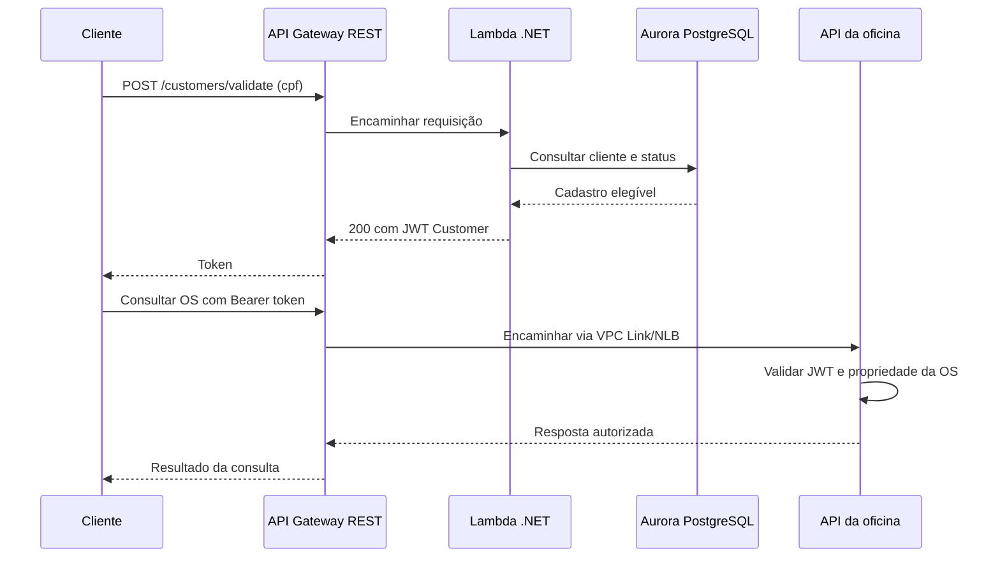

# Autenticação de Clientes do Sistema de Gerenciamento de Mecânica

Repositório da futura função AWS Lambda que valida o CPF de um cliente e emite um JWT para acesso às suas ordens de serviço. O login com senha dos usuários internos permanece na API da oficina.

## Estado da implementação

Este repositório contém somente README e arquivos de configuração do Git. **Ainda não há função executável, projeto .NET, testes, Terraform, pipeline ou endpoint publicado.** As instruções de build, execução e deploy serão adicionadas junto dos respectivos artefatos.

A tecnologia definida é .NET 10 em AWS Lambda, empacotada como ZIP, com Aurora PostgreSQL e JWT compatível com a API. O contrato compartilhado `GerenciamentoMecanica.Auth.Contracts` ainda será extraído da aplicação e publicado como pacote NuGet.

## Responsabilidades e limites

A função deverá normalizar/validar CPF, consultar diretamente o cliente e seu status com credencial de leitura limitada, verificar elegibilidade e emitir JWT de role Customer. Conexões serão encerradas ao fim da operação, sem pooling, conforme a arquitetura aceita.

Não haverá login do cliente com senha, refresh token ou gerenciamento de OS nesta função. Criação de OS continua exclusiva da oficina. A API valida assinatura, role e propriedade das ordens ao receber o token. Segredos não vêm do corpo da requisição.

## Fluxo planejado



O diagrama não representa uma implantação existente. Casos de CPF inválido e cliente inelegível seguem o contrato abaixo.

## Contrato HTTP planejado

`POST /customers/validate`, encaminhado pelo API Gateway à Lambda, com `Content-Type: application/json`:

```json
{
  "cpf": "529.982.247-25"
}
```

| Código | Resultado |
|---|---|
| 200 | Token no corpo, sem envelope de sessão/refresh token |
| 400 | Corpo ou CPF inválido |
| 401 | CPF válido sem cliente elegível: inexistente ou Inativo |
| 5xx | Falha técnica inesperada da função ou integração; não converter em 401 |

A fonte completa é o [contrato de acesso e autenticação](https://github.com/pknfelps/GerenciamentoMecanicaSistema/blob/develop/docs/arquitetura/ACESSO_E_AUTENTICACAO.md). A função usará HS256, expiração de dez minutos, issuer/audience/chave compatíveis com a API do mesmo ambiente e claims obtidas do cadastro. Configuração secreta ficará no Secrets Manager.

A consulta depende de campos/modelo que ainda serão implementados no repositório de banco. O SQL atual não possui o status de cliente necessário para esse fluxo.

## Pré-requisitos e execução

Para consultar a documentação, basta Git. Para a futura implementação serão necessários .NET SDK 10, pacote de contratos em versão fixa e configuração de acesso ao PostgreSQL/JWT. Testes automatizados e mecanismo de execução local serão definidos junto do projeto.

Não há comando `dotnet build`, teste ou invocação local aplicável neste checkout. O login interno existente pode ser exercitado em `POST /authentication` na [API da oficina](https://github.com/pknfelps/GerenciamentoMecanicaSistema/tree/develop).

## CI e deploy planejados

O workflow deverá compilar, testar e empacotar um ZIP versionado; Terraform/IAM da função pertencerão a este repositório. A entrega AWS usará OIDC e dependerá de rede privada, banco com esquema, credenciais de leitura e segredo JWT. O contrato OpenAPI será publicado junto da versão da função e consumido pela infraestrutura para compor o Gateway.

A observabilidade seguirá OpenTelemetry com extensão Collector local na Lambda e exportação ao New Relic. Versões/compatibilidade e testes de correlação ainda serão verificados. Não há CI ou deploy configurado nesta etapa.

## Desenvolvimento e ambientes

Todo trabalho parte da `develop` atualizada, com branch de tarefa e PR para `develop`. A promoção `develop -> main` ocorrerá ao concluir a entrega. **hom** e **prd** terão funções e configurações próprias, compatíveis com API e banco do mesmo ambiente; essa separação ainda será provisionada.

## Referências

- [Arquitetura de execução](https://github.com/pknfelps/GerenciamentoMecanicaSistema/blob/develop/docs/arquitetura/rfcs/001-EXECUCAO.md).
- [Entrega e contratos entre componentes](https://github.com/pknfelps/GerenciamentoMecanicaSistema/blob/develop/docs/arquitetura/rfcs/002-ENTREGA.md).
- [Dados e observabilidade](https://github.com/pknfelps/GerenciamentoMecanicaSistema/blob/develop/docs/arquitetura/rfcs/003-DADOS-E-OBSERVABILIDADE.md).
- [Infraestrutura](https://github.com/pknfelps/GerenciamentoMecanicaInfraestrutura/tree/develop).
- [Banco](https://github.com/pknfelps/GerenciamentoMecanicaBancoDados/tree/develop).
